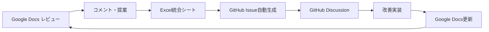

# 合同会社型DAO規程 フィードバック収集システム設計書

## システム概要

本システムは、GitHubに馴染みのない専門家（弁護士、税理士、業界関係者等）から効率的にフィードバックを収集し、GitHub上のプロジェクトに統合するためのハイブリッド・システムです。

## 🎯 設計目標

- **アクセシビリティ**: GitHubの技術的ハードルを排除
- **使いやすさ**: Google Docs レベルの操作性
- **トレーサビリティ**: 全フィードバックの記録・追跡
- **効率性**: 手動作業の最小化
- **品質確保**: 専門性の高いフィードバック収集

---

## 📋 Phase 1: 気軽なフィードバック収集システム

### 1.1 Google Docs レビューシステム

#### 📁 Google Drive構成
```
📂 LLCDAO規程レビュー_v2.0
├── 📂 01_レビュー用文書（コメント可能）
│   ├── 📄 定款v2.0_レビュー用.docx
│   ├── 📄 トークン規程v2.1_レビュー用.docx
│   ├── 📄 DAO総会規程v2.0_レビュー用.docx
│   ├── 📄 運営規程v2.0_レビュー用.docx
│   ├── 📄 トレジャリー管理規程v1.0_レビュー用.docx
│   └── 📄 DAO憲章v1.0_レビュー用.docx
├── 📂 02_参考資料
│   ├── 📄 プロジェクト設計趣意書.pdf
│   ├── 📄 規程改善完了報告書.pdf
│   └── 📄 整合性チェックリスト.pdf
├── 📂 03_フィードバック集約
│   ├── 📊 フィードバック統合シート.xlsx
│   ├── 📄 専門分野別コメント集.docx
│   └── 📄 改善提案一覧.docx
└── 📂 04_質問・議論
    ├── 📄 Q&A共有文書.docx
    └── 📄 議論ログ.docx
```

#### 🔧 Google Docs設定

**権限設定**:
```
レビュアー権限:
- 閲覧 + コメント追加
- 提案モード（編集提案）
- ダウンロード不可（機密保持）

管理者権限:  
- 編集・管理・共有
- コメント承認・却下
- バージョン履歴管理
```

**コメントテンプレート**:
```
【法的観点】
条文: 第○条第○項
指摘事項: 
改善提案:
重要度: ★★★☆☆
理由:

【技術的観点】  
該当箇所:
指摘事項:
技術的代替案:
実装難易度: 高/中/低
```

### 1.2 構造化フィードバック収集

#### 📊 Excel統合管理シート
```excel
A列: 規程名
B列: 条文番号  
C列: レビュアー名
D列: 専門分野
E列: 指摘事項
F列: 改善提案
G列: 重要度（1-5）
H列: ステータス（未対応/検討中/対応済み）
I列: 対応予定日
J列: 対応内容
K列: GitHub Issue番号
```

#### 🎯 専門分野別レビューシート

**法務レビューシート**:
- 会社法適合性
- 定款との整合性  
- 法的リスク評価
- 規制対応状況

**税務レビューシート**:
- 税務処理の明確性
- 配当・分配の適正性
- 源泉徴収義務
- 消費税の取扱い

**技術レビューシート**:
- セキュリティ要件
- 実装可能性
- コスト評価
- 運用負荷

---

## 🔄 Phase 2: GitHub統合システム

### 2.1 自動同期システム

#### Google Apps Script による自動化
```javascript
// フィードバック統合スクリプト
function syncFeedbackToGitHub() {
  // Excel シートからデータ読み込み
  const sheet = SpreadsheetApp.getActiveSheet();
  const data = sheet.getDataRange().getValues();
  
  // GitHub API経由でIssue作成
  data.forEach(row => {
    if (row[7] === '未対応') { // ステータス列
      createGitHubIssue({
        title: `[${row[0]}] ${row[4]}`, // 規程名 + 指摘事項
        body: formatIssueBody(row),
        labels: [row[3], `priority-${row[6]}`] // 専門分野, 重要度
      });
    }
  });
}

function formatIssueBody(row) {
  return `
## 指摘事項
${row[4]}

## 改善提案  
${row[5]}

## 詳細情報
- **規程**: ${row[0]}
- **条文**: ${row[1]}
- **レビュアー**: ${row[2]} (${row[3]})
- **重要度**: ${row[6]}/5
- **元データ**: [Google Sheets](${SHEET_URL})
  `;
}
```

### 2.2 GitHub Discussions活用

#### 専門分野別ディスカッション
```
📋 Categories:
├── 🏛️ 法務・コンプライアンス
├── 💰 税務・会計
├── 🔧 技術・実装
├── 📊 運用・プロセス
├── 🌐 国際・規制
└── 💡 一般・その他
```

#### テンプレート例
```markdown
## 法務レビュー・ディスカッション

### 対象規程
- [ ] 定款v2.0
- [ ] トークン規程v2.1
- [ ] DAO総会規程v2.0
- [ ] 運営規程v2.0
- [ ] トレジャリー管理規程v1.0
- [ ] DAO憲章v1.0

### 論点
<!-- 法的論点を整理してください -->

### 参考法令・判例
<!-- 関連する法令や判例があれば記載 -->

### 改善提案
<!-- 具体的な改善案を提示 -->

### 影響評価
<!-- 他の規程や運用への影響を評価 -->
```

---

## 🎮 Phase 3: 段階的GitHub導入

### 3.1 GitHub初心者向けガイダンス

#### 📚 ステップ・バイ・ステップガイド
```
Step 1: アカウント作成（5分）
├── GitHub.com でアカウント作成
├── メール認証完了
└── プロフィール設定

Step 2: 基本操作習得（15分）
├── リポジトリ閲覧方法
├── ファイルの閲覧・検索
├── Issue作成方法
└── コメント投稿方法

Step 3: 実践参加（10分）
├── 担当規程の確認
├── 初回コメント投稿
├── 他者とのやり取り
└── フィードバック投稿
```

#### 🎯 ハンズオンサポート
- **個別オンボーディング**: 1-on-1でのGitHub操作説明
- **操作動画ガイド**: 画面録画による操作手順説明
- **FAQ文書**: よくある質問と回答集
- **サポートチャット**: Slack/Discordでのリアルタイム質問対応

### 3.2 ハイブリッド・ワークフロー

#### 🔄 統合フロー


---

## 🛠️ 実装ツール・サービス

### 必要なツール

#### 📊 Google Workspace
- **Google Docs**: 文書レビュー・コメント
- **Google Sheets**: フィードバック統合管理
- **Google Forms**: 構造化フィードバック収集
- **Google Apps Script**: 自動化・API連携

#### 🐙 GitHub機能
- **Issues**: 課題管理・追跡
- **Discussions**: 専門的議論・Q&A
- **Wiki**: ドキュメント・ガイド
- **Actions**: 自動化・通知

#### 🔗 連携サービス  
- **Zapier/IFTTT**: サービス間自動連携
- **Slack/Discord**: コミュニケーション
- **Calendly**: レビュー会議調整
- **Loom**: 操作説明動画作成

---

## 📅 導入スケジュール

### Week 1: システム構築
- Google Drive構成設定
- 文書のdocx変換・アップロード
- 権限設定・共有準備
- フィードバックシート作成

### Week 2: テスト運用
- 内部メンバーでのテスト
- Google Apps Script開発
- GitHub連携テスト
- 操作ガイド作成

### Week 3: 専門家招待
- レビュアー招待・オンボーディング
- 初回フィードバック収集
- 問題点の洗い出し・改善
- サポート体制整備

### Week 4: 本格運用
- 全専門家への展開
- フィードバック収集開始  
- GitHub統合本格稼働
- 継続改善プロセス確立

---

## 📊 成功指標（KPI）

### 参加率指標
- **レビュアー参加率**: 招待者の80%以上が参加
- **アクティブ参加率**: 週1回以上のフィードバック投稿
- **継続参加率**: 1ヶ月間の継続参加70%以上

### 品質指標  
- **フィードバック品質**: 具体的改善提案を含む割合80%以上
- **対応率**: フィードバックへの対応・回答率90%以上
- **解決率**: 提起された課題の解決率70%以上

### 効率性指標
- **レスポンス時間**: フィードバックへの初回対応48時間以内
- **統合効率**: Google Docs → GitHub統合の自動化率80%以上
- **運用負荷**: 管理者の手動作業時間50%削減

---

## 🔒 セキュリティ・機密保持

### アクセス制御
- **段階的権限付与**: 信頼度に応じた権限設定
- **機密レベル設定**: 文書の機密度分類
- **アクセスログ**: 全アクセス履歴の記録
- **定期権限見直し**: 月次でのアクセス権限確認

### 情報保護
- **NDA締結**: 全レビュアーとの機密保持契約
- **ダウンロード制限**: 重要文書のダウンロード禁止
- **透かし挿入**: 文書への識別情報埋め込み
- **版権管理**: バージョン履歴・変更追跡

---

## 💬 コミュニケーション戦略

### 専門家エンゲージメント

#### 🎯 価値提案
- **業界標準化への貢献**: 日本DAO運営の標準作成参画
- **専門知識の活用**: 各分野専門性の活かし方
- **ネットワーキング**: 他分野専門家との交流機会
- **実績・評価**: 貢献への適切な評価・認知

#### 📢 継続的コミュニケーション
- **月次進捗報告**: フィードバック反映状況の共有
- **感謝の表現**: 貢献への定期的な謝意表明
- **成果共有**: プロジェクト成果への貢献明示
- **将来展望**: 次段階プロジェクトへの継続参画

---

## 🔄 継続改善プロセス

### フィードバックの質向上
1. **レビュアー・トレーニング**: 効果的フィードバックの方法論共有
2. **ベストプラクティス共有**: 良質なフィードバック事例の紹介
3. **相互レビュー**: レビュアー間でのクロスチェック
4. **品質評価**: フィードバックの有効性評価・改善

### システム改善
1. **利用状況分析**: ツール使用状況の定期分析
2. **満足度調査**: レビュアーの使いやすさ評価
3. **機能改善**: 要望に基づく機能追加・改善
4. **効率化**: 作業プロセスの継続的最適化

---

**更新履歴**:
- v1.0: 2025年6月21日 - 初版作成
- 次回更新予定: 実装開始後のフィードバック反映時 