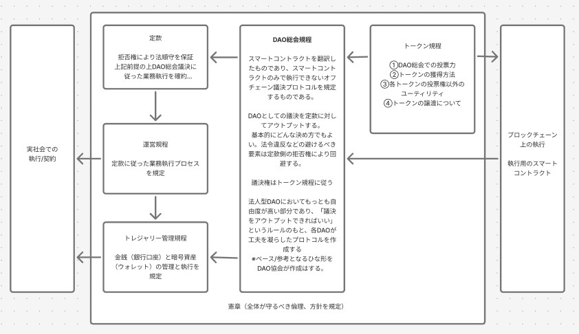

## 定款と規程の構成（Structure）

本ドキュメントは、定款と各規程・別紙の構成、相互参照、版管理の枠組みを示します。初見の方でも「どの文書が基準で、何をどこに書くか」が一目で分かることを目的とします。

### はじめに（3分で全体像）
- これは何のための文書か  
  日本の合同会社を使ってDAOを運営するときに必要な「ルール一式（定款・規程・別紙）」です。技術者や地域でDAOを始めたい方でも、法務に詳しくなくても、どのルールをどこに書けばよいか分かるように設計しています。

- ファイルの役割（たとえ付きで理解）  
  - 定款（会社の設計図）: 会社としての土台。だれが社員か、どう決めるか、誰が責任者か。めったに変えません。  
  - DAO総会規程（会議の進め方マニュアル）: どう通知し、どう審議し、どう投票・決定し、どう結果を公開するか。  
  - 運営規程（実務のやり方）: 決まったことを誰がどう執行し、何を公開・報告するか。  
  - トークン規程（トークンの取扱説明書）: 権利・発行・再発行・移転の可否・無効化など。  
  - 別紙（設定ファイル）: 投票期間や閾値、アドレス、使用ツールなど“変えやすい数値や手段”をまとめます。

- 意思決定の流れ（ざっくり）  
  提案（Issue/議題） → DAOで投票 → 社員の同意（法的な最終承認） → 実行（オフチェーン/オンチェーン） → 公開・記録  
  現行法では業務執行の責任をDAO構造で免除できないため、重要な議案は「DAO投票→社員同意」の二段階で確定します。

- 最初の3ステップ  
  1) スコープを確認（あなたのDAOが対象に合うか）  
  2) 別紙の必須パラメータを埋める（投票期間・定足数・トークン等）  
  3) ひな形を採択して発効（決議・公開・運用開始）

### 1. 全体マップ（役割と配置）
- 定款（01_*.md）  
  会社の「土台」。社員資格・意思決定の枠組み・代表/業務執行の基本・配当/残余財産などを規定。変更は最も重い（社員同意）。
- DAO総会規程（02_*.md）  
  意思決定の具体運用（招集、審議、投票、決議の成立、結果の開示）。投票方式・閾値等の可変は別紙へ。
- 運営規程（03_*.md）  
  役割と責務、執行、報告・公開、細則の設置、改廃手続など。総会決議の執行レイヤー。
- トークン規程（04_*.md）  
  社員権/ガバナンス等トークンの権利義務・発行・再発行・譲渡制限・無効化等。可変のパラメータは別紙へ。
- 別紙（appendices/）  
  - DAO総会別紙.md: 投票方式・期間・閾値・定足数などのガバナンス・パラメータ  
  - トークン別紙.md: 供給、付与基準、移転可否、メタデータ要件、各種アドレス等  
  - 共通運用.md: 使用ツールや公開媒体などの“手段”の一覧（可変・非規範的）
- ガイド（docs/guide/）  
  - context.md: 設計思想とスコープ（対象/非対象、トレードオフ）  
  - structure.md: 本ドキュメント（構成・参照・版管理）  
  - dao-runbook/: 実運用ランブック（回すための手順）

#### 図（概念図）
以下の図は、各文書群と実社会/ブロックチェーン実装の対応関係を示す概念図です。

### 2. 参照関係と規範階層
- 規範の優先順位: 法令 > 定款 > 各規程（02/03/04） > 別紙 > ガイド
- 参照の基本ルール
  - 02/03/04 は定款を根拠にする（例: 総会権限、代表選任、執行の責任）
  - 別紙は 02/04 から参照される可変パラメータ置き場（本文は「別紙参照」と記載）
  - 共通運用.md は“手段”のみ（期限や要件は本文側に残す）
- 変更時の整合
  - 本文に定めた枠組みを変更しない限り、別紙更新で運用調整が可能
  - 本文と別紙に齟齬が出た場合は本文（規程）が優先

### 3. 用語・定義・可変値の所在
- 基本概念・権限構造: 定款/各規程の本文に置く（規範）  
- パラメータ（期間・閾値・重み・上限値）: 別紙に置く（可変）  
- ツール名・公開媒体・URL・アドレス: 共通運用.md に置く（可変・説明的）  
- 用語の一貫性: 新規用語は初出文書に定義し、以降は同語同義で使用（別名義/略語の追加は避ける）

### 4. 版管理とリリース（リポジトリ運用）
- 採択中の最新版はリポジトリ直下の `01_*.md`〜`04_*.md` と `appendices/`  
- ブランチ/PR: `docs/**`（ガイド）と本体（01〜04/appendices）は原則PRを分ける  
- リリース: `release` ブランチへマージ、必要に応じてタグ `vX.Y.Z` を付与  
- 区分: 重大（定款/投票要）・通常（規程/レビュー）・軽微（誤字/体裁）  
- 採択・発効: 規程ごとの決議手続に従う（例: 総会の通常/重要決議）

### 5. 別紙の役割と更新
- 目的: 本文の抽象度を維持しつつ、運用上の可変値を安全に更新する
- 更新手順: 規程で定める決議に基づき改定、改定後は公開導線（レポジトリ/サイト）を更新
- 代表的な項目
  - DAO総会別紙: 投票方式、投票期間、定足数、閾値、投票権重み係数
  - トークン別紙: 供給・配布、移転可否、ベスティング、権限付与、主要アドレス
  - 共通運用: ウォレット/投票/アナウンス/公開の各ツールと設定

### 6. 互換性ポリシー（Compatibility）
- マイナー更新（別紙/運用ツールの変更）は、過去の決議・記録の可読性を損なわない範囲で後方互換を維持
- メジャー変更（意思決定構造・権限の変更等）は移行計画（告知・発効日・必要な再採択）を伴う
- 破壊的変更が不可避な場合は、旧版のアーカイブと差分の公開を必須とする

### 7. 新規文書の追加・変更フロー（概要）
1) 影響範囲の特定（本文か別紙か、参照先はどこか）  
2) Issue/ドラフト作成（目的・差分・整合性チェック）  
3) PRレビュー（法務/運用/技術の観点）  
4) 決裁（規程に基づく決議）  
5) リリース・周知・アーカイブ（タグ付与・公開導線更新）

### 8. チェックリスト（抜粋）
- [ ] 本文に置くべき内容か（枠組み/規範）？ 別紙へ委譲できるか（可変）？  
- [ ] 参照関係（上位文書→本文→別紙）が崩れていないか？  
- [ ] 用語・定義が既存と一致しているか？  
- [ ] 採択/発効手続・公開導線が整っているか？

注: 本文書は参考資料であり、規程本文ではありません。

